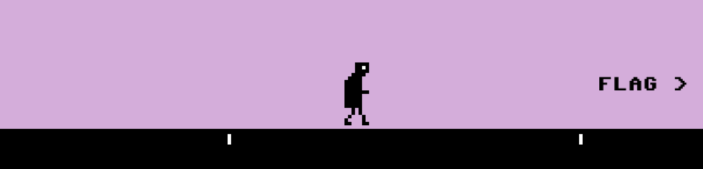

# *Let's Play: Ancient Greek Punishment: Competition Edition*

# [Play Online](https://www.pippinbarr.com/lets-play-ancient-greek-punishment-competition-edition/) (desktop only)

## Description
*Fly like an eagle! Climb every mountain! Reach for the stars! I mean apple! Empty your opponent's bathtub just before they get in!*

_Let's Play: Ancient Greek Punishment: Competition Edition_ is a new edition in the _Let's Play: Ancient Greek Punishment_ series, focusing on a retelling of five (kind of) mythological punishments. In the _Competition Edition_ the dream of a two-player experience of eternal punishment is finally at hand. Face off against your friends in the classic battle between punisher and punished.

The game was written in JavaScript using the excellent [Phaser](https://phaser.io) game framework.

## Press
Read the [Press kit](../press) for press information

## Documentation
* Read the [Process documentation](../process/README.md) for process journal, to do list, and related work
* Read the [Commit History](https://github.com/pippinbarr/lets-play-ancient-greek-punishment-competition-edition/commits/master) for step-by-step information about how the project was built
* Look at the [Code Repository](https://github.com/pippinbarr/lets-play-ancient-greek-punishment-competition-edition) for source code etc.

## License
_Let's Play: Ancient Greek Punishment: Competition Edition_ is an open source game licensed under a [Creative Commons Attribution-NonCommercial 3.0 Unported License](http://creativecommons.org/licenses/by-nc/3.0/). You can obtain the source code from its [code repository](https://github.com/pippinbarr/lets-play-ancient-greek-punishment-competition-edition) on GitHub.
