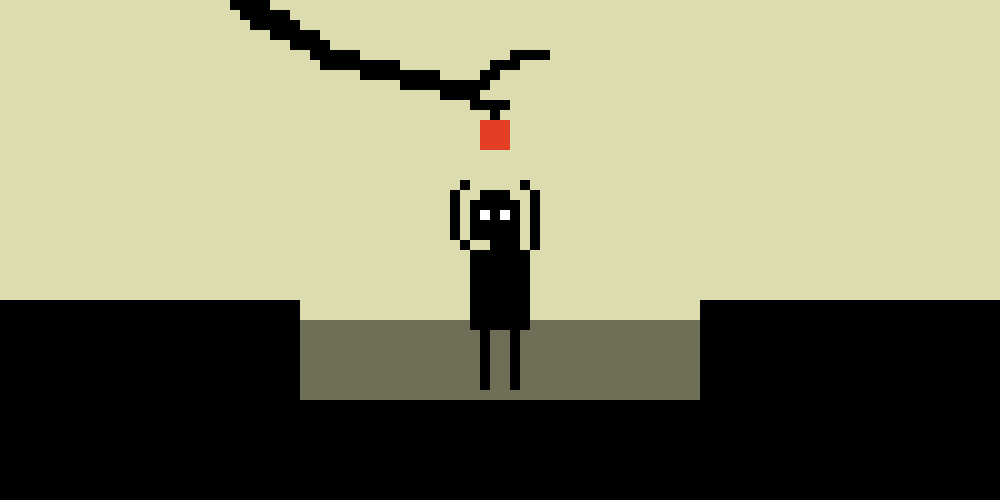
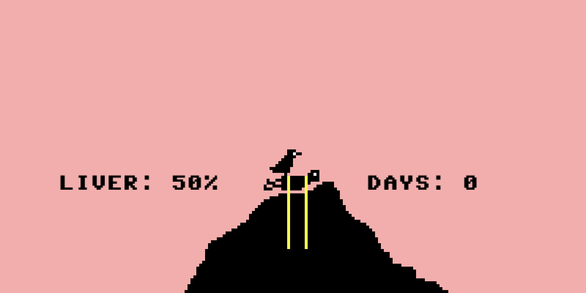
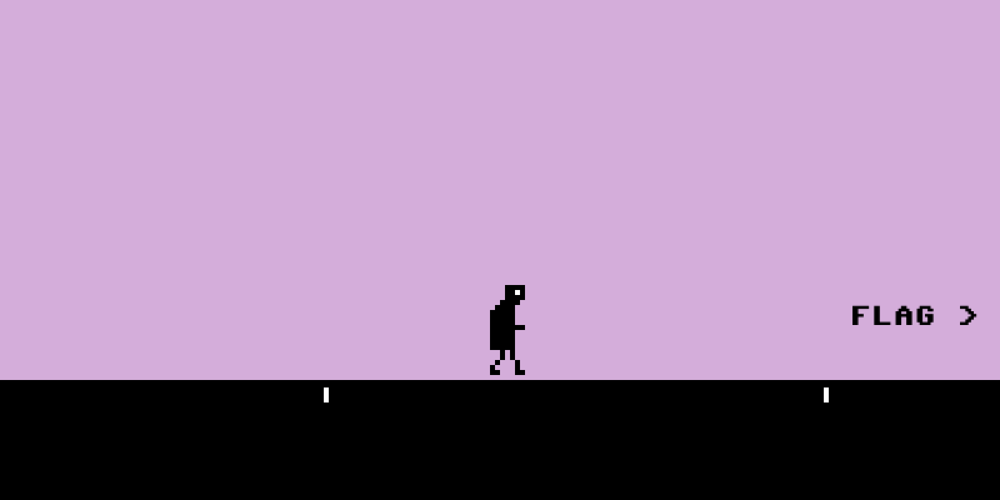

# _Let's Play: Ancient Greek Punishment: Competition Edition_ Press Kit

_Fly like an eagle! Climb every mountain! Reach for the stars! I mean apple! Empty your opponent's bathtub just before they get in!_

#### [Play _Let's Play: Ancient Greek Punishment: Competition Edition_](https://pippinbarr.github.io/lets-play-ancient-greek-punishment-competition-edition)

## The basics

* Developer: [Pippin Barr](http://www.pippinbarr.com/)
* Release: 4 September 2019
* Platform: Browser (desktop)
* Code repository: https://github.com/pippinbarr/lets-play-ancient-greek-punishment-competition-edition
* Price: $0.00

## Who is this Pippin Barr guy?

Pippin is an experimental game developer who has made games about everything from [Eurovision](http://www.pippinbarr.com/2012/03/27/epic-sax-game/) to [performance art](http://www.pippinbarr.com/2011/09/14/the-artist-is-present/) to [dystopian post-work futures](http://www.pippinbarr.com/games/2017/07/03/it-is-as-if-you-were-doing-work.html). He's an Assistant Professor in the [Department of Design and Computation Arts](http://www.concordia.ca/finearts/design.html) at [Concordia University](http://www.concordia.ca/) in Montréal. He is also the associate director of the [Technoculture, Art, and Games (TAG)](http://tag.hexagram.ca/) Research Centre, which is part of the [Milieux Institute for Arts, Culture, and Technology](http://milieux.concordia.ca/).

## Description

In _Competition Edition_ two players compete head to head as figures/objects from classic myths of punishment in Hades. So, for example, one player takes the role of Sisyphus, pushing a boulder uphill. Unfortunately for them, the second player takes the role of the boulder itself, and can push back! So it goes for Tantalus (one player reaches for fruit and water that the other player can take away), the Danaid (one player seeks to fill a bath and clean themselves while the other player empties the bath), Prometheus (one player is chained to a rock while the other takes control of an eagle to peck out their liver), and Zeno (one player runs toward the finish line while the other player moves it further away). Sounds like fun, right?

_Let's Play: Ancient Greek Punishment: Competition Edition_ is the twelfth edition in the _Let's Play: Ancient Greek Punishment_ series begun in 2011 and comprising: [Let's Play: Ancient Greek Punishment](http://www.pippinbarr.com/games/letsplayancientgreekpunishment/LetsPlayAncientGreekPunishment.html) (2011), [Art Edition Edition](http://www.pippinbarr.com/games/letsplayletsplayancientgreekpunishmentarteditionedition/) (2015), [Limited Edition](http://www.pippinbarr.com/games/letsplayancientgreekpunishmentlimitededition/) (2016), [CPU Edition](http://pippinbarr.github.io/letsplayancientgreekpunishmentcpuedition/) (2017), [Inversion Edition](https://pippinbarr.github.io/lets-play-ancient-greek-punishment-inversion-edition) (2019), [UI Edition](https://pippinbarr.github.io/lets-play-ancient-greek-punishment-ui-edition) (2019), [Teaches Typing](https://pippinbarr.github.io/lets-play-ancient-greek-punishment-teaches-typing) (2019), [Chess Edition](https://pippinbarr.github.io/lets-play-ancient-greek-punishment-chess-edition) (2019), [The Twine](https://pippinbarr.github.io/lets-play-ancient-greek-punishment-the-twine/) (2019), the [Bitsy Demake](https://pippinbarr.github.io/lets-play-ancient-greek-punishment-bitsy-demake/) (2019), and [Five-in-One](https://pippinbarr.github.io/lets-play-ancient-greek-punishment-five-in-one/) (2019).

## History

_Competition Edition_ is part of my ongoing idea of essentially spending 2019 making variations on the base _Ancient Greek Punishment_ set of minigames as a way to remain "productive" while in transition to a life with a new baby. In fact, I've ended up making a few other games this year as well, but the punishment series has been my chief focus.

In the case of competition edition, I had already created both the original dynamic of the player engaged as the human figure in each punishment as well as the "inverted" version in which the player took on the role of tormentor (boulder, eagle, etc.). It just made sense to join these two ideas together to pit players head to head in an eternal test of wills - it's like track and field except nobody wins! Here I'm particularly interested in the possible dynamics of play when you get two local players acting and thwarting each other's actions. There seems to be an opening, for instance, for real-world physical interventions, with "Sisyphus" perhaps slapping away the "boulder's" hands in order to succeed. Although I don't ordinarily make multiplayer games, I do find the relationship established between players quite funny, particularly given the asymmetries of the roles (it's always "easier" to be the tormentor than the tormentee, but then only the tormentee can ever really "win").

_Let's Play: Ancient Greek Punishment: Competition Edition_ is also another reference point in the ultra-detailed process documentation approach called [MDMA](http://www.gamesasresearch.com/mdma). In this case, because the game is so simple, there's less documentation that I usually produce. Nonetheless, you can read a little about the game's development by reading its [process documentation](https://github.com/pippinbarr/lets-play-ancient-greek-punishment-competition-edition/blob/master/process/README.md) or by going through its [commit history](https://github.com/pippinbarr/lets-play-ancient-greek-punishment-competition-edition/commits/master).

## Technology

_Let's Play: Ancient Greek Punishment: Competition Edition_ was created using [Phaser 3](https://phaser.io), my favourite 2D games library for JavaScript.

## License

_Let's Play: Ancient Greek Punishment: Competition Edition_ is an open source game licensed under a [Creative Commons Attribution-NonCommercial 3.0 Unported License](http://creativecommons.org/licenses/by-nc/3.0/). You can obtain the source code from its [code repository](https://github.com/pippinbarr/lets-play-ancient-greek-punishment-competition-edition) on GitHub.

## Features

- Fly like an eagle!
- Climb every mountain!
- Races that go on for days!
- Water slipping through your fingers!
- Emptying someone's bath just before they get in!

### Trailer

Honestly it's probably faster to just play actual game.

## Images

  
_Sisyphus vs. Boulder_

  
_Tantalus vs. Apple_

  
_Prometheus vs. Eagle_

  
_Danaid vs. Bathtub_

  
_Zeno vs. Flag_

## Additional Links

- [Process documentation of _Let's Play: Ancient Greek Punishment: Competition Edition_](https://github.com/pippinbarr/lets-play-ancient-greek-punishment-competition-edition/blob/master/process/README.md)
- [Commit history of _Let's Play: Ancient Greek Punishment: Competition Edition_](https://github.com/pippinbarr/lets-play-ancient-greek-punishment-competition-edition/commits/master)

## Credits

* Pippin Barr: basically everything?

## Contact

* Email: [pippin.barr+press@gmail.com](mailto:pippin.barr+press@gmail.com)
* Website: [www.pippinbarr.com](http://www.pippinbarr.com/)
* Twitter: [@pippinbarr](https://www.twitter.com/pippinbarr)
* Instagram: [@pippinbarr](https://www.instagram.com/pippinbarr)
* Facebook: [Pippin Barr](http://www.facebook.com/pippin.barr)
